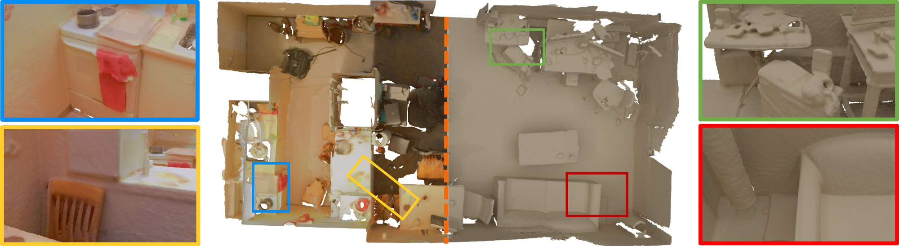

# BundleFusion



You are free to use this code with proper attribution in non-commercial applications (Please see [License.txt](License.txt)).

More information about this project can be found in our [paper](https://arxiv.org/pdf/1604.01093.pdf) and [project website](http://graphics.stanford.edu/projects/bundlefusion/).

## Installation
The code was developed under VS2013, and tested with a Structure Sensor.

Requirements:
- DirectX SDK June 2010
- NVIDIA CUDA 7.0
- our research library mLib, a git submodule in external/mLib
- mLib external libraries can be downloaded [here](http://kaldir.vc.in.tum.de/mLib/mLibExternal.zip)

Optional:
- Kinect SDK (2.0 and above)
- Prime sense SDK


## Citation:  
```
@article{dai2017bundlefusion,
  title={BundleFusion: Real-time Globally Consistent 3D Reconstruction using On-the-fly Surface Re-integration},
  author={Dai, Angela and Nie{\ss}ner, Matthias and Zoll{\"o}fer, Michael and Izadi, Shahram and Theobalt, Christian},
  journal={ACM Transactions on Graphics 2017 (TOG)},
  year={2017}
}
```

## Contact:
If you have any questions, please email Angela Dai at adai@cs.stanford.edu.


We are also looking for active participation in this open source effort making large-scale 3D scanning publically accessible. Please contact us :)
